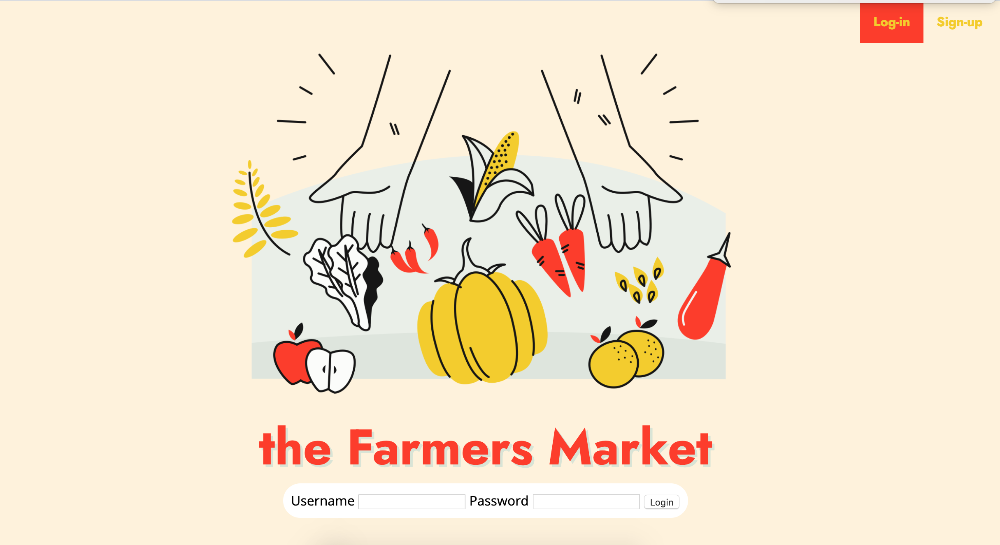
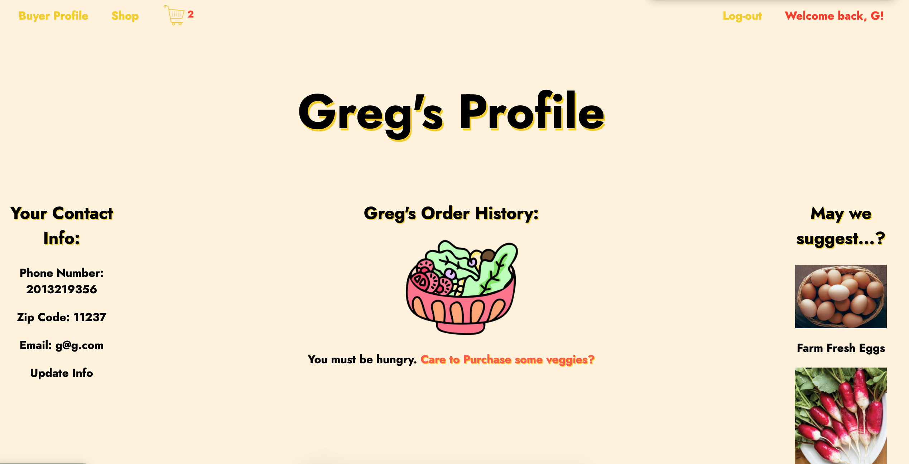
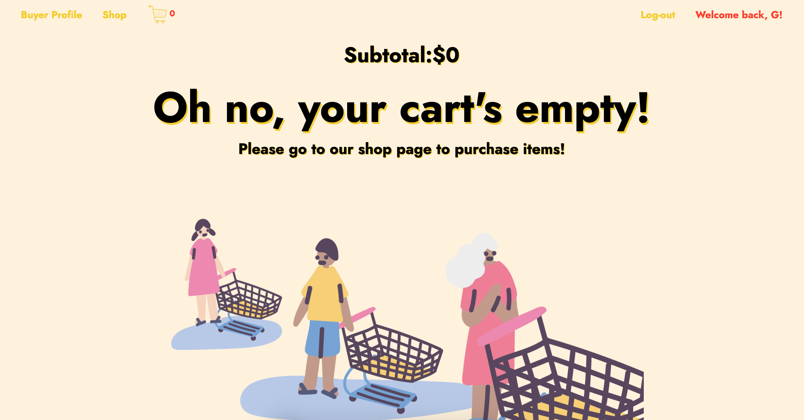

<h1><b>The Farmers Market </b></h1>
<i><h3>Fresh Produce From Farm to Door!</i></h3>

The Farmers Market is an app to help you support local farmers from the comfort of your home. Safely browse the current inventory and have farm fresh food delivered to you.

<!-- <h2>Gems Included:</h2>
<ul>
<li>gem "activerecord"</li>
<li>gem "sinatra-activerecord"</li>
<li>gem "sqlite3"</li>
<li>gem "pry"</li>
<li>gem "require_all"
<li>gem "faker"</li>
<li>gem 'rest-client'</li>
<li>gem 'json'</li>
<li>gem 'rmagick'</li>
<li>gem 'catpix'</li>
<li>gem 'tco'</li>
<li>gem 'down'</li>
<li>gem 'tty-prompt'</li>
<li>gem 'pastel'</li> -->
<!--  
<i>NOTE: In addition to these gems, you will also need to install ImageMagick.</i>
</ul> -->

<h2>How to Install</h2>
<ul>
  <li>Fork and clone this repo</li>
  <li>Navigate to this directory</li>
  <li>'bundle install' for all required gems</li>
  <li>'rake db:seed && rails s'</li>

</ul>

<!-- <h2>Overview</h2>

The Farmers Market is built with Ruby on Rails and is designed t -->

<h2>Screenshots/Video</h2>
 

